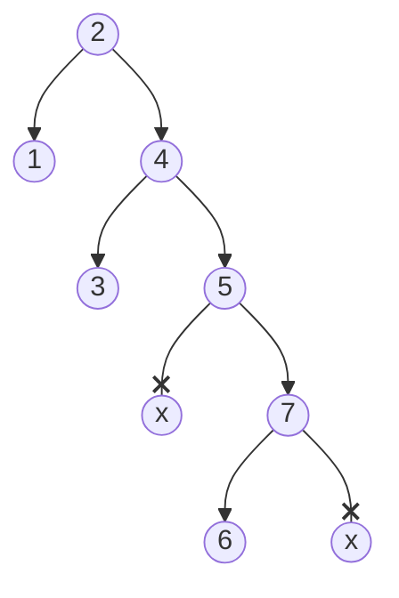
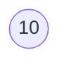
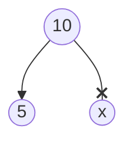
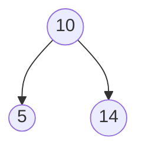
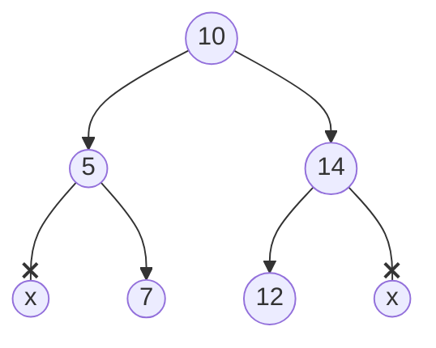

# Árboles Binarios de Búsqueda

> - Búsqueda, inserción y borrado:
>   - Promedio $O(log_2(n))$
>   - Caso peor $O(n)$

Un árbol binario es un ABB si cumple estas condiciones:

- Dado un nodo `x` se cumple que:
    - Todos los elementos en el subárbol izquierdo de `x` son **menores**[^1] que el elemento en `x`
    - Todos los elementos en el subárbol derecho de `x` son **mayores** que el elemento en `x`

A diferencia del APO, un árbol binario de búsqueda no requiere estar balanceado.

`ABB 1:`

- El **menor** de los elementos será el nodo más a la izquierda 
    - Este nodo será hoja o tendrá un hijo a la derecha
- El **mayor** de los elementos será el nodo más a la derecha
    - Este nodo será hoja o tendrá un hijo a la izquierda
- En este Árbol, el mínimo es 1 y el máximo es 7

### Construcción de un ABB

- Conjunto de claves: `{10,5,14,7,12 }`

1. Árbol con un solo nodo

2. `5 < 10`, se inserta a la izquierda

3. (`14`)

4. (`7`, `12`)

- La eficiencia de la inserción será $O(log_2(n))$ en promedio
- En el caso peor (conjunto de datos ya ordenado) la eficiencia es $O(n)$
- El recorrido en **inorden** de un ABB nos da la lista de nodos ordenada de mayor a menor. 
- Los tipos `set` y `map` de la STL se implementan con una variante balanceada de ABB (las claves del `set` y `map` de la STL siempre están ordenadas)

### Borrados

`borrar(n)`

1. Si `n` es una hoja, la solución es trivial
2. Si `n` es hijo izquierdo y tiene un solo hijo, asignamos ese hijo como hijo izquierdo del padre
3. Si `n` es hijo derecho y tiene un solo hijo, asignamos ese hijo como hijo derecho del padre
3. Si `n` tiene dos hijos: sustituir `n` por el nodo que venga justo antes o después en el **inorden**

[^1]: Menores o iguales, pero normalmente no tenemos claves repetidas.