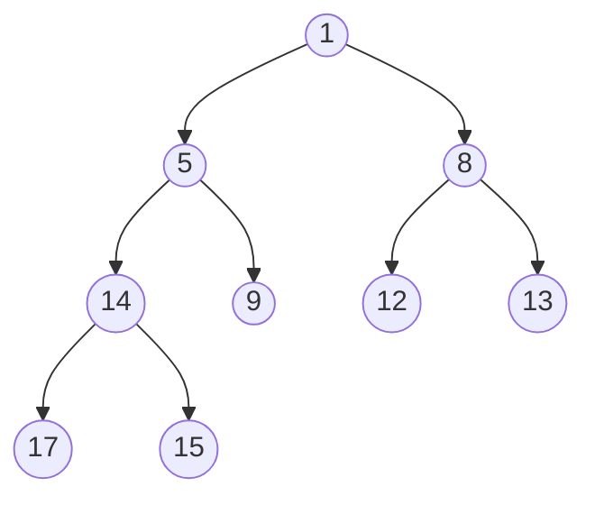

# Árboles Binarios Parcialmente Ordenados

> - Inserción: $O(log_2(n))$ ^[1]
> - Borrar mínimo: $O(log_2(n))$
> - Búsqueda: $O(n)$
>
> Heap Sort: $O(n \times log_2(n))$

Los **APO** se utilizan para implementar colas con prioridad y para el algoritmo de ordenación **Heap Sort**.

Un árbol binario es un **APO** si cumple estas condiciones:
- La etiqueta de cada nodo es menor o igual que las etiquetas de los hijos[^2]
- Es un árbol binario **casi completo**
    - tiene todos los niveles completos
    - el último nivel puede tener huecos a la derecha

Lo visualizamos como un árbol binario, pero en realidad se representa como un **vector** o array. Las funciones típicas son **insertar** elementos y borrar el **nodo raíz** (elemento mínimo)

### Representación: El Heap

Representación vectorial del árbol.
- `M[0]` es la raíz
- `M[1]` es el hijo izquierdo
- `M[2]` es el hijo derecho
- El hijo izquierdo del nodo k está en `M[2k+1]`
- El hijo derecho del nodo k está en `M[2k+2]`
- El padre del nodo k está en `M[floor(k-1/2)]`

`APO 1`:

```
índices    0 1 2 3  4 5  6  7  8
Heap  M = [1 5 8 14 9 12 13 17 15]

Hijo izquierdo de M[2] = M[2 * 2 + 1] = M[5] = 12
Hijo derecho de M[2] = M[2 * 2 + 2] = M[6] = 13
```

### Inserción

Para insertar un elemento en un APO:

1. Insertamos el elemento en el hueco del último nivel (o en un nuevo nivel)
2. Intercambiamos con el nodo padre hasta que se cumpla la condición del APO

La eficiencia de esta operación es $O(log_2(N))$.

<!--
TODO: Aquí se puede añadir ejemplo con diagrama
-->

### Borrado

En un APO siempre vamos a borrar la raíz (el elemento **mínimo**).

Para borrar la raíz:

1. Se sustituye la raíz por el elemento más a la derecha del último nivel
2. El más pequeño de los hijos de la raíz se intercambia con esta hasta que se cumpla la condición del APO.

### Aplicaciones

**Heap Sort**

- Heap Sort es de los algoritmos de ordenación más rápidos
- Más rápido que Quicksort en el caso peor, ambos son $O(n \times log_2(n))$
- Heapsort es preferible si el conjunto de datos es muy dinámico (muchas inserciones y borrados)

Funciona así:

Dado un conjunto de enteros `arr` y un heap vacío `M`

1. Insertamos en `M` todos los elementos de `arr` (construir heap a partir de `arr`)
2. Borramos la raíz del heap (elemento mínimo)
3. Repetir paso 2 hasta vaciar el heap

Los elementos se eliminan de `M` de menor a mayor.

<!-- 
TODO: ejemplo con heap sort
-->

**Colas con prioridad**

- Se puede usar un APO para implementar una cola con prioridad
- Con un heap es fácil mantener un conjunto de datos ordenado entre inserciones y borrados


[^1]: Si el conjunto de datos insertado YA estaba ordenado, las inserciones se realizan en $O(1)$
[^2]: Menor o igual para un APO-min, mayor o igual para un APO-max. Aquí solo hablamos de APO-min