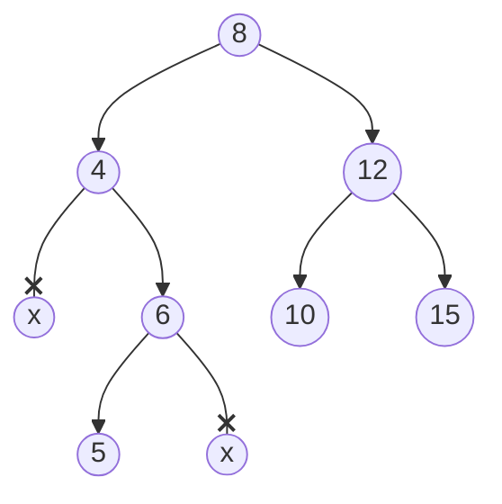

# Árboles AVL (Adelson-Velsky Landis)

Variación balanceada del Árbol de Búsqueda Binaria para mejorar la eficiencia de las búsquedas.

Cumple las siguientes propiedades:

1. Dado un nodo `x` se cumple que:
    - Todos los elementos en el subárbol izquierdo de `x` son **menores** que el elemento en `x`
    - Todos los elementos en el subárbol derecho de `x` son **mayores** que el elemento en `x`
2. Está equilibrado: Para un nodo `n`, la altura del subárbol `n->left` y la altura del subárbol `n->right` NO pueden variar en más de 1

En el peor de los casos, la busqueda se realiza en $O(log_2(n))$


El siguiente árbol no cumple las propiedades:



1. La altura de un nodo `n` es la longitud del camino más largo desde `n` hasta una hoja.
1. Los nodos que no existen tienen altura `h = -1`
1. Las hojas tienen altura `h = 0`

- En el árbol anterior, existe un **desequilibrio en el nodo 4**: 
    - `altura(n4->left) = -1` 
    - `altura(n4->right) = 1`

NO es un AVL

Ejemplo equilibrado:

```mermaid
graph TD
```

Este árbol SÍ es un AVL

## Operaciones sobre un AVL

Tendremos que implementar funciones auxiliares para **mantener equilibrado** el
árbol tras realizar inserciones y borrados.

### Búsqueda 

La búsqueda en un AVL es igual que en un ABB

### Inserción 

1. Buscar posición de inserción
2. Insertar elemento
3. Equilibrar el árbol (si es necesario)


### Borrado

### Equilibrio en inserciones y borrados

Para equilibrar un árbol desequilibrado, se aplican **rotaciones simples** o **rotaciones dobles**

- El nodo `n` está desequilibrado (`abs(altura(n->left) - altura(n->right)) > 1`)
- La inserción se ha hecho a **la izquierda de la izquierda** o a **la derecha de la derecha** (subárboles exteriores) => aplicamos rotación simple
- La inserción se ha hecho a **la derecha de la izquierda** o a **la izquierda de la derecha** (subárboles interiores) => aplicamos rotación doble

<!--
TODO: aquí faltan dibujitos
-->

- Caso A: desequilibrio en `n` al insertar a la _izquierda de la izquierda_ de `n`
    - **Rotación simple a la derecha**
- Caso D: desequilibrio en `n` al insertar a la _derecha de la derecha_ de `n`
    - **Rotación simple a la izquierda**
- Caso B: desequilibrio en `n` al insertar a la _derecha de la izquierda_ de `n`
    - **Rotación doble hacia la derecha:**
        - Rotación simple a la izquierda sobre `n->left`
        - Rotación simple a la derecha sobre `n`
- Caso C: desequilibrio en `n` al insertar a la _izquierda de la derecha_ de `n`
    - **Rotación doble hacia la izquierda:**
        - Rotación simple a la derecha sobre `n->right`
        - Rotación simple a la izquierda sobre `n`