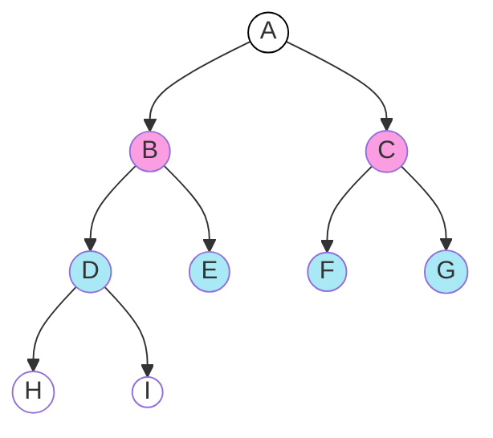

# Árboles

Un árbol se compone de _nodos_:
- **Raíz**, no tiene nodo padre, está en la parte superior de la jerarquía.
- **Hoja**, no tienen nodos hijo, están en la parte inferior de la jerarquía.
- **Interior**, el resto de nodos.

- Nodo raíz: `A`
- Nodos hoja: `H` `I` `E` `F` `G`
- Nivel 0: `A`
- Nivel 1: `B` `C`
- Nivel 2: `D` `E` `F` `G`
- Nivel 3: `H` `I`