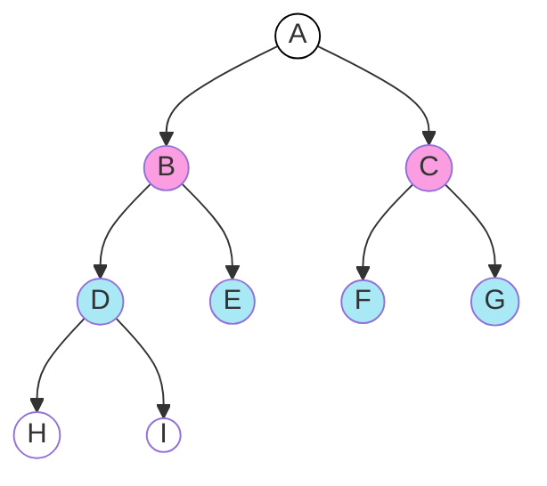
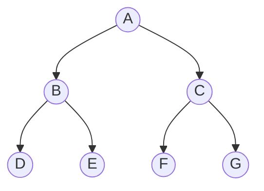

# Árboles

Un árbol se compone de _nodos_:
- **Raíz**, no tiene nodo padre, está en la parte superior de la jerarquía.
- **Hoja**, no tienen nodos hijo, están en la parte inferior de la jerarquía.
- **Interior**, el resto de nodos.

Los árboles son estructuras **recursivas** y generalmente, las funciones definidas 
sobre los árboles usan algoritmos recursivos.

`Árbol 1`


- Nodo raíz: `A`
- Nodos hoja: `H` `I` `E` `F` `G`
- Nivel 0: `A` 
- Nivel 1: `B` `C`
- Nivel 2: `D` `E` `F` `G` 
- Nivel 3: `H` `I` 
- **Grado**: 2
- **Ancestros** del nodo `e` = `{b,a}`
- **Descendientes** del nodo `b` = `{d,e,h,i}`
- Altura(A) = 3
- Altura(E) = 0
- Altura(D) = 1
- Altura(C) = 1

### Grado de un árbol

- **Grado** de un **nodo**: Subárboles (nodos hijo) que tiene un nodo
    - Nodos hoja tienen grado `0`
- **Grado de un árbol**: máximo de los grados de sus nodos

### Camino entre dos nodos

Es la secuencia de nodos que hay que visitar para alcanzar el nodo $n_j$ desde el nodo $n_i$

En el ejemplo:

```
Camino(a,h) = {a,b,d,h}
Longitud 3
```

La **altura** de un nodo `n` es la longitud del camino más largo desde `n` hasta una hoja.

### Árboles n-arios y árboles binarios

- Un nodo de un árbol n-ario puede tener hasta n subárboles (hijos)
- Un nodo de un **árbol binario** tiene dos subárboles (hijos) **identificados** (hijo izquierdo e hijo derecho)
    - Un árbol binario no es un caso particular de un árbol n-ario
    - Un árbol binario tiene como máximo $2^i$ nodos en el nivel $i$

#### Tipos de árboles binarios

- **Homogéneo**: Nodos tienen **0** o **2** hijos (tienen grado 0 o 2, nunca 1)
- **Completo**: Tiene todos los niveles llenos
    - **Casi-completo**: Tiene todos los niveles llenos excepto en el último nivel, que pueden quedar huecos a la derecha

El ejemplo del principio es un árbol binario homogéneo casi-completo

Un ejemplo de árbol binario completo:

`Arbol 2`:


### Recorrer un árbol

Podemos usar algoritmos **recursivos** o **iterativos**
- Recursivos: **preorden**, **inorden**, **postorden**
- Iterativos: por niveles, de izquierda a derecha.

En estos ejemplos, uso una TDA de árboles simplificado:

```c++
struct TreeNode {
    int val;
    TreeNode *left;
    TreeNode *right;
    TreeNode(int x) : val(x), left(NULL), right(NULL) {}
};
```

#### Recorrido por niveles:

Para el recorrido por niveles, usamos una cola

```c++
void level_order(TreeNode *root) {
	if(root == NULL) return;

	queue<TreeNode*> Q;
	Q.push(root);  

	// Mientras queden nodos en la cola
	while(!Q.empty()) {
		TreeNode* current = Q.front();
		Q.pop(); 
		cout << current->data << " ";
		if(current->left != NULL) Q.push(current->left);
		if(current->right != NULL) Q.push(current->right);
	}
}
```

Recorrido del `Arbol 2`: `{ABCDEFG}` 

### Recorrido en preorden

```c++
void preorder(TreeNode *root) {
	if (root == nullptr) return;

	cout << root->val               // data
	preorder(root->left);           // left
	preorder(root->right);          // right
}

```

Recorrido del `Arbol 2`: `{A, B, D, E, C, F, G}`

### Recorrido en inorden

```c++
void inorder(TreeNode *root) {
	if (root == nullptr) return;

	inorder(root->left);           // left
	cout << root->val << '\n';     // data
	inorder(root->right);          // right
}
```

Recorrido del `Arbol 2`: `{D, B, E, A, F, C, G}`

### Recorrido en postorden

```c++
void postorder(TreeNode *root) {
	if (root == nullptr) return;

	postorder(root->left);           // left
	postorder(root->right);          // right
	cout << root->val << '\n';       // data
}
```

Recorrido del `Arbol 2`: `{D, E, B, F, G, C, A}`

### Información ancestral

Dados los nodos `n` y `m` de un árbol binario
- Recorrido en **Preorden**: `n` a la izquierda de `m` => `n` es ancestro de `m`
- Recorrido en **Postorden**: `n` a la izquierda de `m` => `n`es descendiente de `m`