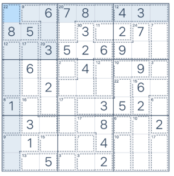

> # Entrega Killer Sudoku
> 
> **Reto 1: Abstracción** 
>

## Introducción

Se ha implementado la estructura de datos del Killer Sudoku mediante tres matrices 
con nueve filas y nueve columnas cada una.

- La **primera matriz** representa la versión clásica del sudoku, se usa el valor `0` para indicar las posiciones que todavía no están resueltas.
- La segunda y la tercera sirven para definir las restricciones de la versión "Killer" del sudoku.
    - La **segunda matriz** Define la suma que deben alcanzar los números de cada área.
    - La **tercera matriz** numera las áreas que hay en el tablero (en el ejemplo de abajo hay 29, de la `00` a la `28`)

Por ejemplo, este sudoku:



Se representa en memoria mediante estas tres matrices:

```
:[example_sudoku.txt](example_sudoku.txt)
```


## Especificación en `KillerSudoku.h`

```c++
:[SudokuKiller.h](KillerSudoku.h)
```