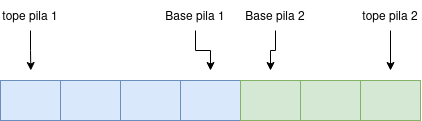
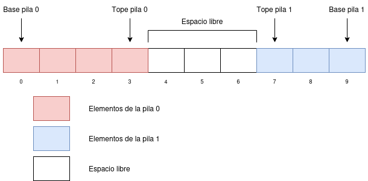
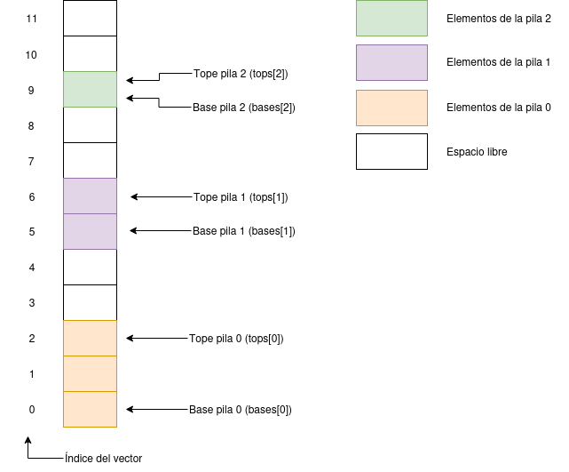

<!-- 
Nota. Transformado en pdf con la extensión de vscode Markdown PDF. 
Aunque recomiendo usar LaTeX ;)
-->
> # Entrega TDA Lineales
> 
> **Reto 2: TDA Lineales** 
>
> Victoria

## Parte 1. Tipo de dato `pila_doble`

Se pide definir un tipo de dato `pila_doble` que almacena **dos pilas** en una 
estructura de datos de tipo **`vector`**. En las operaciones sobre `pila_doble`, se indica
mediante un parámetro cual es la pila que queremos modificar.

```cpp
void pila_doble<T>::push(int numpila, const T & elem)
void pila_doble<T>::pop(int numpila)
```


### Opción 1: Pila creciente y pila decreciente

Con esta estructura, las pilas crecen hacia los extremos. Una de las pilas crece hacia el extremo derecho
del vector, y otra crece hacia el extremo izquierdo del vector.

- Cuando insertamos en la **pila 1**, el nuevo elemento se inserta en la posición `0` del vector, y el resto de elementos se desplazan hacia la derecha
- Cuando insertamos en la **pila 0**, el nuevo elemento se inserta en la posición a la derecha del tope de la pila 0

Esta opción queda descartada porque es menos eficiente, no se puede insertar en tiempo lineal ()





### Opción 2: Pila par y pila impar

En esta definición, los elementos de la **pila 0** se insertan en los 
índices **pares** del vector, mientras que los elementos de la **pila 1** se 
insertan en los índices **impares** del vector.

La ventaja de esta opción es que muy sencilla de implementar, la desventaja 
es que hace un uso menos eficiente del espacio cuanto mayor es la diferencia
de tamaño entre las dos pilas.


He incluido un posible fichero de cabecera para esta opción

**`pila_doble_par_impar.h`**
```c++
:[pila_doble](ejercicio_1/pila_doble_pi.h)
```

### Opción 3: Pila derecha y Pila izquierda

Esta es la opción que sugiere el enunciado del reto. En este caso, ambas pilas
crecen hacia el centro del vector, es decir, el espacio libre está entre las
dos pilas.

Cuando queda poco espacio libre, se debe aumentar el tamaño del vector y desplazar hacia la derecha la pila 1

Esta opción requiere una implementación más compleja porque contiene más operaciones
relacionadas con desplazar elementos existentes en el vector. En este caso también es más costoso
modificar el **espacio libre** disponible en el vector.



## Parte 2 Tipo de dato `vector_pilas`

En el segundo ejercicio, se pide crear un tipo de dato `vector_de_pilas`, que consiste en un vector que almacena una cantidad determinada (`n`) de pilas.

### Especificación

Para solucionar el problema necesitaremos:

- Un **vector** `data` que contiene todas las pilas
- Un vector `bases` que almacena los índices de las bases de las pilas
- Un vector `tops` que almacena los índices de los topes de las pilas
- Un vector `sizes` que almacena el tamaño de las pilas.

Uso `vector<int>` en lugar de arrays para poder añadir nuevas pilas a la estructura
una vez ya está creada

Un método muy importante en este TDA es `shift_right(int position, int times)`, que desplaza el vector `data` hacia la derecha (hacia arriba en el esquema) para crear espacio libre entre dos pilas o después de la última pila. Este método también se encarga de actualizar el array `bases` y el array `tops` para las pilas que han sido desplazadas.

> **Nota:**<br>
> También podemos implementar la pila doble del ejercicio 1 como un caso particular de este ejercicio.



En el esquema de ejemplo, los vectores tienen los siguientes datos:

```
tops  = {2, 6, 9}
bases = {0, 5, 9}
sizes = {3, 2, 1}
```

**`vector_pilas.h`**
```c++
:[pila_doble](ejercicio_2/vector_pilas.h)
```