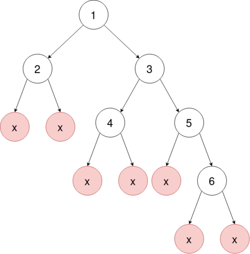

<!-- 
Nota. Transformado en pdf con la extensión de vscode Markdown PDF. 
Aunque recomiendo usar LaTeX ;)
-->

> # Entrega TDA no lineales I
> 
> **Reto 3: TDA no lineales I** 
>
> Victoria
> 
> 30/11/2025

## Objetivo

Diseñar procedimiento para escribir y leer en disco un árbol binario de forma
que se recupere la estructura jerárquica de forma unívoca.

1. Escribir un árbol binario en una cadena de texto (función `serialize`)
2. Transformar una cadena de texto en un árbol binario (función `deserialize`)

## Diseño

- He diseñado e implementado una variación de la representación por niveles con centinelas.
- El algoritmo agrupa los caracteres que indican nodos nulos para que ocupen menos espacio.

Por ejemplo:

El árbol:



<br>

Se representa:

- Por niveles con centinelas: `1 2 3 * * 4 5 * * * 6 * *`
- Versión optimizada: `1 2 3 *2 4 5 *3 6 *2`

## Implementación

```c++
:[serialize_bintree](levelorder.cpp)
```

## Ejemplo de ejecución

El código de la función `main` imprime por pantalla este resultado: 

```
    == TEST 1 ==
Árbol serializado:
1,2,3,*2,4,5,*3,6,*2,

Inorden del árbol reconstruido: 
2, 1, 4, 3, 5, 6, 
Preorden del árbol reconstruido: 
1, 2, 3, 4, 5, 6, 

Árbol reconstruido serializado otra vez:
1,2,3,*2,4,5,*3,6,*2,


     == TEST 2 ==
Árbol serializado:
1,2,3,4,5,6,7,*3,8,*6,

Inorden del árbol reconstruido: 
4, 2, 5, 8, 1, 6, 3, 7, 
Preorden del árbol reconstruido: 
1, 2, 4, 5, 8, 3, 6, 7, 

Árbol reconstruido serializado otra vez:
1,2,3,4,5,6,7,*3,8,*6,
```